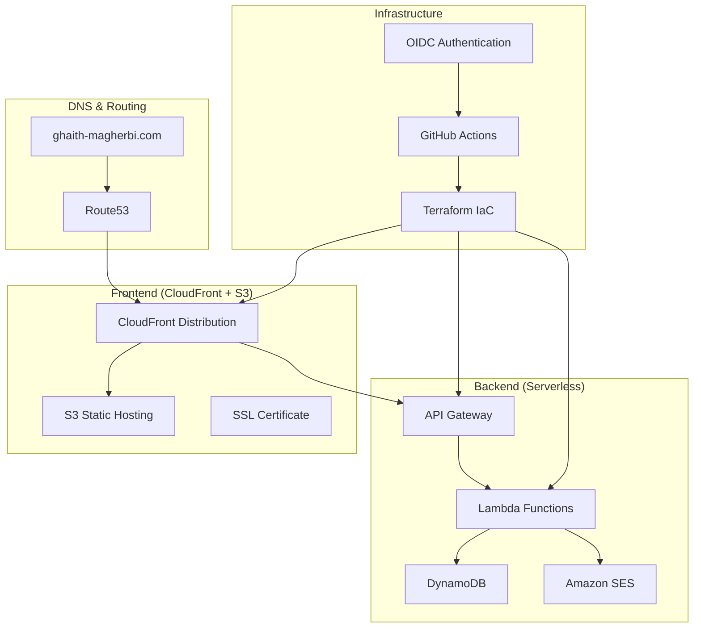

# Cloud/DevOps Portfolio Project

[](https://github.com/MGhaith/my-Portfolio/actions/workflows/workflow.yml)
[](https://ghaith-magherbi.com)

## Overview

Production-ready serverless portfolio demonstrating modern Cloud and DevOps engineering practices. Built with Infrastructure as Code, automated CI/CD pipelines, and AWS serverless architecture.

## Architecture



## Key Features

### Infrastructure & DevOps
- **Multi-Environment**: Production and staging environments
- **Infrastructure as Code**: Terraform modules with remote state
- **CI/CD Pipeline**: GitHub Actions with OIDC authentication
- **Security**: No static credentials, least-privilege IAM
- **Monitoring**: CloudWatch integration and alerting

### Architecture
- **Serverless Backend**: AWS Lambda, API Gateway, DynamoDB
- **Global CDN**: CloudFront with edge locations
- **Custom Domains**: Route53 DNS with SSL certificates
- **Email Integration**: SES for contact form notifications

## Live Demo

**Portfolio**: [https://ghaith-magherbi.com](https://ghaith-magherbi.com)  
**API**: [https://api.ghaith-magherbi.com](https://api.ghaith-magherbi.com)

## Repository Structure
```
├── infra/                 # Terraform Infrastructure
│   ├── environments/      # Environment-specific configs
│   │   ├── prod/          # Production environment
│   │   └── staging/       # Staging environment
│   └── modules/           # Reusable Terraform modules
├── backend/               # Python Lambda Functions
├── frontend/              # React SPA Application
└── .github/workflows/     # CI/CD Pipeline
```

## Documentation

| Component | Description | Link |
|-----------|-------------|------|
| **Infrastructure** | Terraform modules and multi-environment setup | [infra/README.md](./infra/README.md) |
| **Backend** | Serverless API with Lambda and DynamoDB | [backend/README.md](./backend/README.md) |
| **Frontend** | React SPA with CloudFront deployment | [frontend/README.md](./frontend/README.md) |

## Quick Start

### Deploy Infrastructure
```bash
cd infra/environments/prod
terraform init
terraform plan
terraform apply
```

### Deploy Frontend
```bash
cd frontend
npm install
npm run build
# Automated deployment via GitHub Actions
```

## Technologies

**Infrastructure**: Terraform, AWS (Lambda, API Gateway, DynamoDB, S3, CloudFront, Route53, SES, IAM), GitHub Actions  
**Backend**: Python 3.13, Boto3  
**Frontend**: React 19, TypeScript, Vite, Tailwind CSS  
**Monitoring**: AWS CloudWatch

---

*Production-ready Cloud/DevOps portfolio demonstrating enterprise-grade practices.*