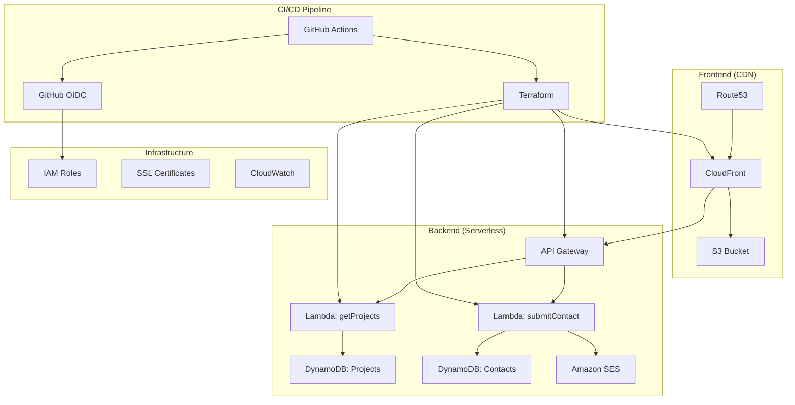

# Cloud/DevOps Portfolio Project 🚀

> A full-stack serverless portfolio showcasing modern Cloud and DevOps engineering practices

[](https://github.com/MGhaith/my-Portfolio/actions/workflows/workflow.yml)
[](https://ghaith-magherbi.com)

## 🎯 What This Project Is

This repository demonstrates a **production-ready Cloud/DevOps portfolio** built with modern serverless architecture and Infrastructure as Code (IaC) principles. It showcases:

- **Infrastructure as Code** with Terraform modules
- **Automated CI/CD** with GitHub Actions and OIDC
- **Serverless Backend** using AWS Lambda, API Gateway, DynamoDB
- **Static Frontend** deployed via CloudFront CDN
- **Security Best Practices** with least-privilege IAM and no static credentials

## 🏗️ Architecture Overview



## 🌟 Key Highlights

### 🔧 Infrastructure as Code (Terraform)
- **Modular Design**: Reusable Terraform modules for different components
- **Remote State**: S3 backend with DynamoDB locking
- **Multi-Region**: Strategic resource placement (US-East-1 for CloudFront, EU-Central-1 for backend)
- **Environment Separation**: Clean staging/production isolation

### 🔄 Automated CI/CD Pipeline
- **GitHub Actions**: Fully automated deployment pipeline
- **OIDC Integration**: Secure AWS access without static credentials
- **Multi-Stage**: Terraform → Frontend build → Deploy → Cache invalidation
- **Testing**: Automated frontend testing with coverage reports

### ⚡ Serverless Backend Architecture
- **API Gateway**: RESTful API with custom domain and SSL
- **AWS Lambda**: Python functions for `/projects` and `/contact` endpoints
- **DynamoDB**: NoSQL database for projects and contact submissions
- **Amazon SES**: Email notifications for contact form submissions
- **Auto-scaling**: Pay-per-use serverless compute

### 🛡️ Security & Best Practices
- **Least Privilege IAM**: Minimal required permissions for each component
- **GitHub OIDC**: No long-lived AWS credentials in repository
- **SSL/TLS**: End-to-end encryption with ACM certificates
- **CORS Configuration**: Secure cross-origin resource sharing

### 📊 Monitoring & Operations
- **CloudWatch Integration**: Automatic logging and monitoring
- **Error Handling**: Comprehensive error responses and logging
- **Performance**: CloudFront CDN for global content delivery

## 🚀 Live Demo

**Portfolio Site**: [https://ghaith-magherbi.com](https://ghaith-magherbi.com)

**API Endpoints**:
- `GET https://api.ghaith-magherbi.com/projects` - Fetch portfolio projects
- `POST https://api.ghaith-magherbi.com/contact` - Submit contact form

## 📁 Repository Structure
```
├── 📂 infra/           # Terraform Infrastructure as Code
├── 📂 backend/         # Python Lambda Functions
├── 📂 frontend/        # React SPA Application
├── 📂 .github/         # CI/CD Pipeline Configuration
└── 📄 README.md        # This file
```
## 🗂️ Documentation Navigation

| Component | Description | Documentation |
|-----------|-------------|---------------|
| **Infrastructure** | Terraform modules, IaC, DevOps practices | [📖 infra/README.md](./infra/README.md) |
| **Backend API** | Python Lambdas, serverless architecture | [📖 backend/README.md](./backend/README.md) |
| **Frontend SPA** | React app, CloudFront deployment | [📖 frontend/README.md](./frontend/README.md) |

## 🎓 Previous Projects Evolution

This project represents the evolution of my cloud journey:

1. **Static Website** → Basic S3 + CloudFront setup
2. **First Serverless API** → Simple Lambda + API Gateway
3. **This Portfolio** → Full production-ready DevOps pipeline

## 🚀 Quick Start

1. **Clone the repository**
   ```bash
   git clone https://github.com/MGhaith/my-Portfolio.git
   cd my-Portfolio
2. **Deploy Infrastructure**
    ```bash
    cd infra
    terraform init
    terraform plan
    terraform apply
3. **Deploy Frontend**
    ```bash
    cd frontend
    npm install
    npm run build
    # Deployment handled by CI/CD pipeline
## 🛠️ Technologies Used

**Infrastructure & DevOps :**
- Terraform, AWS (Lambda, API Gateway, DynamoDB, S3, CloudFront, Route53, SES, IAM)
- GitHub Actions, GitHub OIDC

**Backend :**
- Python 3.13, Boto3, AWS Lambda

**Frontend :**
- React 19, TypeScript, Vite, Tailwind CSS, Radix UI

**Monitoring :**
- AWS CloudWatch, AWS X-Ray

---

*This project demonstrates production-ready Cloud/DevOps engineering practices suitable for enterprise environments.*