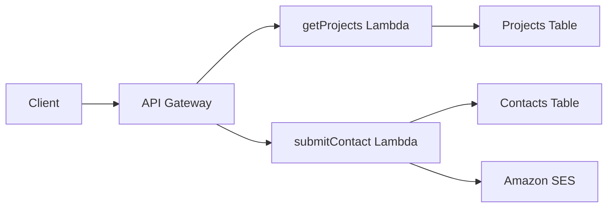

# Serverless Backend API

## Overview

Serverless REST API built with AWS Lambda, API Gateway, and DynamoDB. Provides endpoints for portfolio projects and contact form submissions with email notifications.

## Architecture



## API Endpoints

### GET /projects
- **Function**: `getProjects`
- **Purpose**: Retrieve portfolio projects
- **Response**: JSON array of project objects

### POST /contact
- **Function**: `submitContact`
- **Purpose**: Process contact form submissions
- **Actions**: Store in DynamoDB, send email via SES

## Technical Stack

- **Runtime**: Python 3.13
- **Framework**: AWS Lambda
- **Database**: DynamoDB (NoSQL)
- **Email**: Amazon SES
- **API**: API Gateway with custom domain
- **Authentication**: IAM roles and policies

## Database Schema

### Projects Table
```json
{
  "projectId": "string (PK)",
  "title": "string",
  "description": "string",
  "technologies": ["string"],
  "link": "string",
  "repo": "string"
}
```

### Contacts Table
```json
{
  "contactId": "string (PK)",
  "name": "string",
  "email": "string",
  "message": "string",
  "timestamp": "string (ISO 8601)"
}
```

## Security

- **IAM Roles**: Function-specific permissions
- **CORS**: Configured for frontend domain
- **Input Validation**: JSON schema validation
- **Error Handling**: Structured error responses

## Performance

- **Cold Start**: ~500ms
- **Warm Response**: ~100-200ms
- **Concurrency**: 1000+ simultaneous requests
- **Auto-scaling**: Managed by AWS Lambda

## Deployment

Functions are deployed via Terraform:

```hcl
resource "aws_lambda_function" "get_projects" {
  filename         = "getProjects.zip"
  function_name    = "getProjects"
  runtime         = "python3.13"
  handler         = "app.lambda_handler"
  
  environment {
    variables = {
      PROJECTS_TABLE_NAME = var.projects_table_name
      AWS_REGION         = "eu-central-1"
    }
  }
}
```

## Monitoring

- **CloudWatch Logs**: Function execution logs
- **Metrics**: Duration, errors, invocations
- **Alarms**: Error rate and duration thresholds

---

*Serverless API demonstrating production-ready AWS Lambda architecture.*
