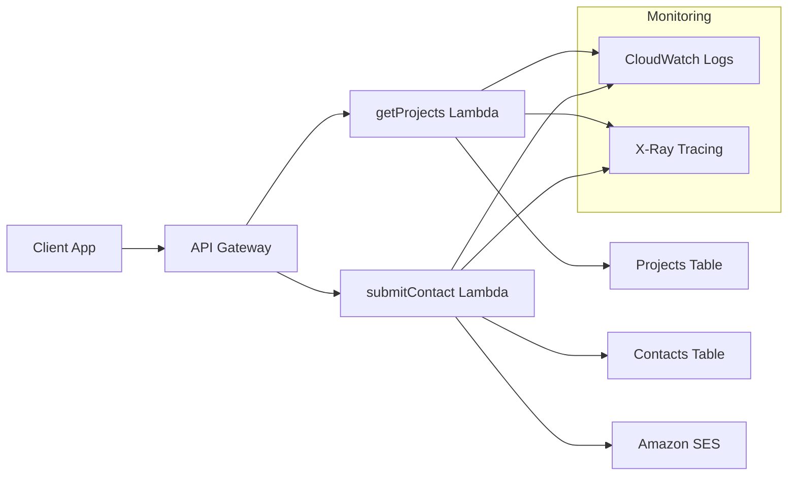

# Serverless Backend API 🐍⚡

> Production-ready serverless API built with Python Lambda functions, API Gateway, and DynamoDB

## 🏗️ Architecture Overview



## 🛣️ API Endpoints

| Method | Endpoint | Function | Purpose |
|--------|----------|----------|----------|
| `GET` | `/projects` | `getProjects` | Retrieve portfolio projects |
| `POST` | `/contact` | `submitContact` | Submit contact form |

### Base URL
- **Production**: `https://api.ghaith-magherbi.com`
- **Custom Domain**: Configured via API Gateway with SSL certificate

## 📁 Code Structure

## 🔧 Function Details

### 1. GET /projects - Portfolio Projects API

**File**: `getProjects/app.py`

```python
def lambda_handler(event, context):
    """
    Handles GET /projects
    Returns all projects from DynamoDB table.
    """
    try:
        response = table.scan()
        items = [serialize_item(i) for i in response.get("Items", [])]
        
        return {
            "statusCode": 200,
            "headers": {"Content-Type": "application/json"},
            "body": json.dumps(items)
        }
    except Exception as e:
        return {
            "statusCode": 500,
            "headers": {"Content-Type": "application/json"},
            "body": json.dumps({"error": str(e)})
        }
```

**Features**:
- **DynamoDB Integration**: Scans PortfolioProjectsTable
- **Data Serialization**: Handles DynamoDB data types (sets → lists)
- **Error Handling**: Comprehensive exception management
- **CORS Support**: Configured via API Gateway

### 2. POST /contact - Contact Form Submission

**File**: `submitContact/app.py`

```python
def lambda_handler(event, context):
    try:
        body = json.loads(event.get("body", "{}"))
        contact_id = str(uuid.uuid4())
        
        # Save to DynamoDB
        table.put_item(Item={
            "contactId": contact_id,
            "name": body["name"],
            "email": body["email"],
            "message": body["message"],
            "timestamp": datetime.utcnow().isoformat()
        })
        
        # Send email via SES
        ses.send_email(
            Source=os.environ["SES_FROM_EMAIL"],
            Destination={"ToAddresses": [os.environ["SES_TO_EMAIL"]]},
            Message={
                "Subject": {"Data": f"New contact from {body['name']}"},
                "Body": {"Text": {"Data": email_content}}
            }
        )
        
        return {"statusCode": 200, "body": json.dumps({"message": "Contact submitted"})}
    except Exception as e:
        return {"statusCode": 500, "body": json.dumps({"error": str(e)})}
```

**Features**:
- **Dual Persistence**: Saves to DynamoDB + sends email via SES
- **UUID Generation**: Unique contact IDs for tracking
- **Timestamp Tracking**: ISO format timestamps
- **Email Notifications**: Real-time notifications via Amazon SES
- **Input Validation**: JSON parsing with error handling

## 🗄️ Database Schema

### Projects Table (`PortfolioProjectsTable`)
```json
{
  "projectId": "string (Primary Key)",
  "title": "string",
  "description": "string",
  "technologies": ["string"],
  "githubUrl": "string",
  "liveUrl": "string",
  "imageUrl": "string",
  "featured": "boolean"
}
```

### Contacts Table (`PortfolioContactsTable`)
```json
{
  "contactId": "string (Primary Key)",
  "name": "string",
  "email": "string",
  "message": "string",
  "timestamp": "string (ISO 8601)"
}
```

## 🚀 Deployment Process

### Terraform-Managed Deployment

The Lambda functions are automatically packaged and deployed via Terraform:

1. **Code Packaging**: Terraform zips Python code + dependencies
2. **Function Creation**: Lambda functions created with proper IAM roles
3. **API Gateway Integration**: Endpoints configured with CORS
4. **Environment Variables**: Injected via Terraform

```hcl
resource "aws_lambda_function" "get_projects" {
  filename         = "getProjects.zip"
  function_name    = "getProjects"
  role            = aws_iam_role.lambda_role.arn
  handler         = "app.lambda_handler"
  runtime         = "python3.9"
  
  environment {
    variables = {
      PROJECTS_TABLE_NAME = var.projects_table_name
      AWS_REGION         = "eu-central-1"
    }
  }
}
```

## ⚡ Serverless Benefits

### Automatic Scaling
- **Concurrent Executions**: Up to 1000 concurrent Lambda invocations
- **DynamoDB Auto-scaling**: Read/write capacity adjusts automatically
- **API Gateway**: Handles traffic spikes seamlessly

### Cost Efficiency
- **Pay-per-Request**: No idle server costs
- **Free Tier**: 1M Lambda requests/month free
- **DynamoDB On-Demand**: Pay only for actual usage

### Operational Benefits
- **No Server Management**: Fully managed by AWS
- **Automatic Updates**: Runtime patches handled by AWS
- **Built-in Monitoring**: CloudWatch integration included

## 📊 Monitoring & Observability

### CloudWatch Metrics
- **Duration**: Function execution time
- **Invocations**: Request count
- **Errors**: Error rate and types
- **Throttles**: Concurrency limit hits

### Logging Strategy
```python
import logging
logger = logging.getLogger()
logger.setLevel(logging.INFO)

def lambda_handler(event, context):
    logger.info(f"Processing request: {event['httpMethod']} {event['path']}")
    # Function logic
    logger.info(f"Request completed successfully")
```

### Error Tracking
- **Structured Logging**: JSON format for easy parsing
- **Error Categorization**: Client vs server errors
- **Correlation IDs**: Request tracing across services

## 🔒 Security Implementation

### IAM Permissions (Least Privilege)
```json
{
  "Version": "2012-10-17",
  "Statement": [
    {
      "Effect": "Allow",
      "Action": [
        "dynamodb:GetItem",
        "dynamodb:PutItem",
        "dynamodb:Scan"
      ],
      "Resource": "arn:aws:dynamodb:eu-central-1:*:table/Portfolio*"
    },
    {
      "Effect": "Allow",
      "Action": ["ses:SendEmail"],
      "Resource": "*"
    }
  ]
}
```

### Input Validation
- **JSON Schema Validation**: Structured input validation
- **Sanitization**: XSS prevention for contact form
- **Rate Limiting**: API Gateway throttling

## 🧪 Testing Strategy

### Local Testing
```bash
# Install dependencies
pip install -r requirements.txt

# Run unit tests
python -m pytest tests/

# Local Lambda simulation
sam local start-api
```

### Integration Testing
- **API Gateway Testing**: End-to-end request/response validation
- **DynamoDB Testing**: Local DynamoDB for development
- **SES Testing**: SES sandbox for email testing

## 📈 Performance Characteristics

### Response Times
- **GET /projects**: ~100-200ms (cold start: ~500ms)
- **POST /contact**: ~200-300ms (includes DynamoDB + SES)

### Throughput
- **Concurrent Requests**: 1000+ simultaneous requests
- **DynamoDB**: 40,000 read/write units on-demand
- **SES**: 200 emails/day (sandbox), unlimited (production)

## 🔄 Future Enhancements

### Planned Features
- **Authentication**: JWT-based API authentication
- **Caching**: Redis/ElastiCache for frequently accessed data
- **Batch Processing**: SQS for async contact processing
- **Advanced Monitoring**: X-Ray distributed tracing

### Scalability Improvements
- **Connection Pooling**: Reuse DynamoDB connections
- **Provisioned Concurrency**: Eliminate cold starts
- **Multi-Region**: Cross-region replication

---

*This serverless backend demonstrates production-ready API development with AWS managed services.*
