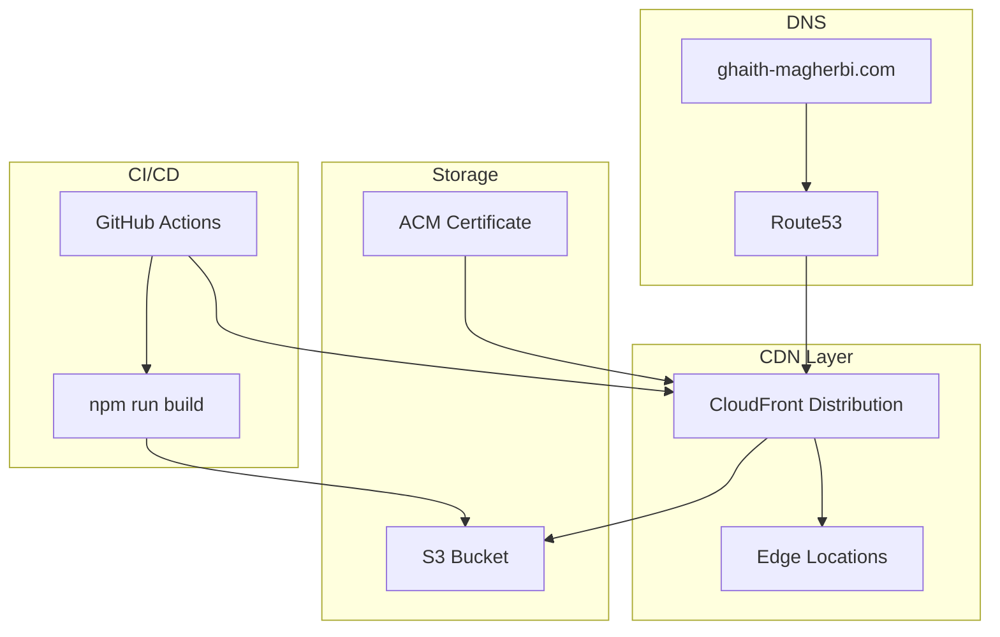

# Frontend React SPA 🎨⚛️

> Modern React single-page application deployed via CloudFront CDN with automated CI/CD

## 🎯 Overview

A responsive React SPA showcasing portfolio projects with a serverless backend integration. Built with modern tooling and deployed through AWS CloudFront for global performance.

## 🏗️ Architecture



## 🛠️ Tech Stack

### Core Framework
- **React 19**: Latest React with concurrent features
- **TypeScript**: Type-safe development
- **Vite**: Fast build tool and dev server

### UI & Styling
- **Tailwind CSS 4**: Utility-first CSS framework
- **Radix UI**: Accessible component primitives
- **Shadcn/UI**: Pre-built component library
- **Lucide React**: Modern icon library

### Routing & State
- **React Router DOM 7**: Client-side routing
- **Next Themes**: Dark/light mode support

### Development Tools
- **ESLint**: Code linting and formatting
- **Vitest**: Unit testing framework
- **TypeScript**: Static type checking

## 📁 Project Structure
```
frontend/
├── 📂 public/
│   └── my-Logo.svg           # Brand assets
├── 📂 src/
│   ├── 📂 components/        # Reusable UI components
│   ├── 📂 pages/            # Route components
│   ├── 📂 api/              # API integration layer
│   ├── 📂 assets/           # Static assets
│   ├── 📂 lib/              # Utility functions
│   ├── 📂 tests/            # Test files
│   ├── 📄 App.tsx           # Main application component
│   ├── 📄 main.tsx          # Application entry point
│   └── 📄 index.css         # Global styles
├── 📄 package.json          # Dependencies and scripts
├── 📄 vite.config.ts        # Vite configuration
├── 📄 tsconfig.json         # TypeScript configuration
└── 📄 components.json       # Shadcn/UI configuration
```
## ✨ Key Features

### 🎨 Modern UI/UX
- **Responsive Design**: Mobile-first approach
- **Dark/Light Mode**: System preference detection
- **Smooth Animations**: Framer Motion integration
- **Accessible Components**: WCAG 2.1 compliance

### 📱 Core Pages
1. **Home**: Hero section with introduction
2. **Projects**: Dynamic project showcase (API-driven)
3. **Contact**: Form submission with SES integration
4. **About**: Professional background and skills

### 🔌 API Integration
```typescript
// API service layer
const API_BASE_URL = 'https://api.ghaith-magherbi.com';

export const projectsApi = {
  getProjects: async () => {
    const response = await fetch(`${API_BASE_URL}/projects`);
    return response.json();
  }
};

export const contactApi = {
  submitContact: async (data: ContactForm) => {
    const response = await fetch(`${API_BASE_URL}/contact`, {
      method: 'POST',
      headers: { 'Content-Type': 'application/json' },
      body: JSON.stringify(data)
    });
    return response.json();
  }
};
```

## 🚀 Build & Deployment Pipeline

### Local Development
```bash
# Install dependencies
npm install

# Start development server
npm run dev

# Run tests
npm run test

# Build for production
npm run build

# Preview production build
npm run preview
```

### Automated CI/CD Pipeline

The GitHub Actions workflow handles:

1. **Dependency Installation**: `npm ci` for reproducible builds
2. **Testing**: `npm run test -- --coverage` with coverage reports
3. **Building**: `npm run build` creates optimized production bundle
4. **Deployment**: `aws s3 sync` uploads to S3 bucket
5. **Cache Invalidation**: CloudFront cache invalidation for immediate updates

```yaml
- name: Install dependencies
  run: npm ci
  working-directory: ./frontend

- name: Run Tests
  run: npm run test -- --coverage
  working-directory: ./frontend

- name: Build React app
  run: npm run build
  working-directory: ./frontend

- name: Sync build to S3
  run: aws s3 sync ./frontend/dist/ s3://ghaith-magherbi.com/ --delete

- name: Invalidate CloudFront cache
  run: |
    aws cloudfront create-invalidation \
      --distribution-id E2ID0F0L5RDMX8 \
      --paths "/*"
```

## 🌐 CloudFront Configuration

### Performance Optimizations
- **Global CDN**: 400+ edge locations worldwide
- **Gzip Compression**: Automatic compression for text assets
- **HTTP/2**: Modern protocol support
- **Caching Strategy**: Optimized cache headers

### Security Features
- **SSL/TLS**: End-to-end encryption with ACM certificate
- **Security Headers**: HSTS, CSP, X-Frame-Options
- **Origin Access Control**: Secure S3 bucket access

### Cache Behavior
├── Default (/ )
│   ├── TTL: 24 hours
│   ├── Compress: Yes
│   └── Viewer Protocol: Redirect HTTP to HTTPS
├── Static Assets (/assets/ )
│   ├── TTL: 1 year
│   └── Cache-Control: immutable
└── API Calls (/api/*)
├── TTL: 0 (no cache)
└── Forward Headers: Authorization

## 📊 Performance Metrics

### Lighthouse Scores (Target)
- **Performance**: 95+
- **Accessibility**: 100
- **Best Practices**: 100
- **SEO**: 95+

### Bundle Analysis
```bash
# Analyze bundle size
npm run build -- --analyze

# Key metrics:
# - Initial bundle: <100KB gzipped
# - Largest chunk: <50KB
# - Total assets: <500KB
```

### Loading Performance
- **First Contentful Paint**: <1.5s
- **Largest Contentful Paint**: <2.5s
- **Time to Interactive**: <3s
- **Cumulative Layout Shift**: <0.1

## 🧪 Testing Strategy

### Unit Testing with Vitest
```typescript
// Component testing example
import { render, screen } from '@testing-library/react';
import { describe, it, expect } from 'vitest';
import { ProjectCard } from './ProjectCard';

describe('ProjectCard', () => {
  it('renders project information correctly', () => {
    const mockProject = {
      title: 'Test Project',
      description: 'Test description',
      technologies: ['React', 'TypeScript']
    };
    
    render(<ProjectCard project={mockProject} />);
    
    expect(screen.getByText('Test Project')).toBeInTheDocument();
    expect(screen.getByText('Test description')).toBeInTheDocument();
  });
});
```

### E2E Testing (Future)
- **Playwright**: Cross-browser testing
- **User Flows**: Critical path validation
- **Visual Regression**: Screenshot comparison

## 🎨 Design System

### Color Palette
```css
:root {
  --primary: 222.2 84% 4.9%;      /* Dark blue */
  --secondary: 210 40% 98%;        /* Light gray */
  --accent: 210 40% 8%;            /* Accent blue */
  --muted: 210 40% 96%;            /* Muted background */
}
```

### Typography Scale
- **Headings**: Inter font family
- **Body**: System font stack
- **Code**: JetBrains Mono

### Component Library
- **Buttons**: Primary, secondary, ghost variants
- **Cards**: Project cards, feature cards
- **Forms**: Contact form, newsletter signup
- **Navigation**: Header, footer, mobile menu

## 🔄 Future Enhancements

### Planned Features
- **Blog Section**: MDX-based blog with syntax highlighting
- **Project Filtering**: Filter by technology, category
- **Search Functionality**: Full-text search across content
- **Progressive Web App**: Service worker, offline support

### Performance Improvements
- **Code Splitting**: Route-based lazy loading
- **Image Optimization**: WebP format, lazy loading
- **Preloading**: Critical resource preloading
- **Service Worker**: Caching strategy for offline support

### Analytics Integration
- **Google Analytics 4**: User behavior tracking
- **Core Web Vitals**: Performance monitoring
- **Error Tracking**: Sentry integration

## 🛠️ Development Setup

### Prerequisites
```bash
# Node.js 18+
node --version

# npm 9+
npm --version
```

### Getting Started
```bash
# Clone repository
git clone https://github.com/MGhaith/my-Portfolio.git
cd my-Portfolio/frontend

# Install dependencies
npm install

# Start development server
npm run dev

# Open browser
open http://localhost:5173
```

### Environment Variables
```bash
# .env.local
VITE_API_BASE_URL=https://api.ghaith-magherbi.com
VITE_SITE_URL=https://ghaith-magherbi.com
```

---

*This frontend showcases modern React development practices with production-ready deployment pipeline.*